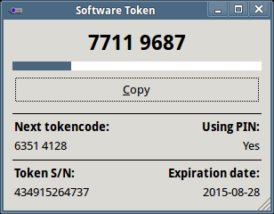
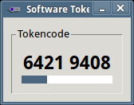

stoken - Software Token for Linux/UNIX
======================================

stoken is a tokencode generator compatible with RSA SecurID 128-bit (AES)
tokens.  The project includes several components:

 * A simple command line interface (CLI) used to manage and manipulate tokens
 * A GTK+ GUI with cut&amp;paste functionality
 * A shared library allowing other software to generate tokencodes on demand

## Building on Linux

### Dependencies

 * libtomcrypt or nettle
 * libxml2
 * libgtk3.0 (required for stoken-gui only)

If you are building from Git, you'll need to install autoconf / automake /
libtool, and run autogen.sh first.  This is not necessary if building from
a released source tarball.

On Debian or Ubuntu, this should satisfy most/all dependencies:

    sudo apt-get install libgtk-3-dev libtomcrypt-dev libxml2-dev libtomcrypt-dev autoconf automake libtool build-essential

### Compile instructions

    ./configure
    make
    make check
    make install

## Usage

First, import a token from a raw string or an "sdtid" XML file:

    stoken import --token 2000123456...
    stoken import --token com.rsa.securid.iphone://ctf?ctfData=2000123456...
    stoken import --file mytoken.sdtid

This will prompt for an optional password, so that your seed is encrypted
on disk.

Next, use the CLI or GUI to show the current tokencode:

    stoken tokencode
    stoken-gui &

If your token requires a PIN, stoken will prompt for it. You can use
<code>stoken setpin</code> to cache your PIN in <code>~/.stokenrc</code>.
This is much less secure, but may be useful for automation.

Modern versions of OpenConnect link against libstoken and can send an
autogenerated tokencode as the password. Import your token using the
above instructions, then:

    openconnect -u USERNAME --token-mode=rsa HOSTNAME

See the man pages for additional details: stoken(1), stoken-gui(1)

See examples/ and src/stoken.h for information on using the shared library
interface (libstoken) to generate tokencodes from other applications.

## Screenshots

<table border=1 cellpadding=15>
<tr align="center">
  <td><code>stoken-gui</code>
  <td><code>stoken-gui --small</code>
<tr valign="top">
  <td>
  <td>
</table>

## Building on other platforms

### Mac OS X

#### Initial setup

The following configuration was tested under Mavericks 10.9.5; other
variants may work too:

 * Install gcc/make/headers: <code>xcode-select --install</code>
 * Install [Homebrew](http://brew.sh/)
 * Install [XQuartz](http://xquartz.macosforge.org/) to support GTK+3
 * Use Homebrew to satisfy dependencies: <code>brew install git autoconf
   automake libtool nettle pkg-config gtk+3 gnome-icon-theme
   hicolor-icon-theme</code>
 * Use OSX's builtin libxml2 (no action needed)

#### Compiling

Note that GNU libtool is called <code>glibtool</code> to avoid collisions
with Apple's libtool program:

    export LIBTOOL=glibtool
    git clone git://github.com/cernekee/stoken
    cd stoken
    bash autogen.sh
    ./configure
    make
    make check
    make install

### Experimental Windows build

As of v0.8, stoken can be built for Windows using the [MinGW cross toolchain
on Fedora](http://fedoraproject.org/wiki/MinGW).  This is not tested
or maintained regularly.

#### Initial setup

On a Fedora 20 PC (other versions may work as well), install the build
dependencies:

    yum groupinstall "Development Tools"
    yum install git autoconf automake libtool mingw32-gnutls mingw32-libxml2 mingw32-gtk3

#### Compiling

    git clone git://github.com/cernekee/stoken
    cd stoken
    bash autogen.sh
    mingw32-configure
    make winpkg

If all goes well, you should be able to copy <code>winpkg.zip</code> to
a Windows PC and run <code>stoken.exe</code> or <code>stoken-gui.exe</code>.

#### TODO

Several items are known to be missing or broken on the Windows build:

 * Default home directory is probably incorrect
 * No installer
 * The GUI requires its assets to be in the current directory
 * Password entry is not masked
 * <code>stoken --random</code> flag
 * No charset translation on filenames

## Misc

Author: Kevin Cernekee &lt;cernekee@gmail.com&gt;

License: LGPLv2.1+

stoken is a hobbyist project, not affiliated with or endorsed by
RSA Security.
